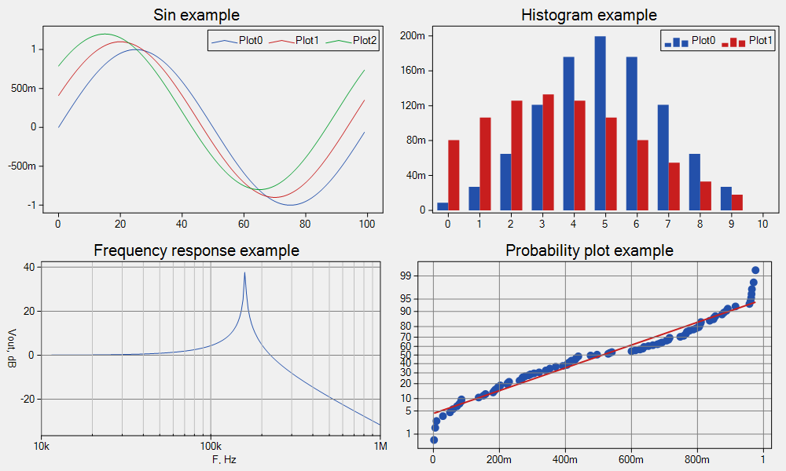

# The OMPlot (one more plot)
The OMPlot is a simple plotting library for .NET Windows.Forms.

## Getting started
1. Add a OMPlot.Plot to your user interface.
2. Choose the appropriate plot style. Use `OMPlot.Plot.PlotStyle` property.
3. Add your data to the plot. Use `OMPlot.Plot.Add` functions.
4. Optional, save result to the image. Call `OMPlot.Plot.ToImage` function.
